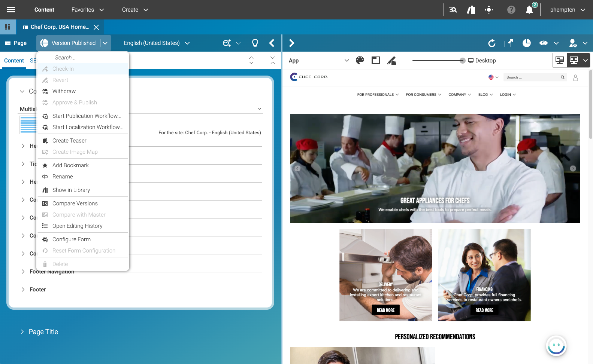

 this project is compatible with.
Please read the versioning section of the project to see what other CoreMedia versions are supported and how to find them.")


# Studio Content Actions for CoreMedia Blueprint
This extension adds a Content-Actions Button to the document form toolbar and removes the Action-Toolbar



The extension is meant to be a code drop. Use it as-is and feel free to adapt it to your needs.

---

## Installation
The extension can be installed in your Blueprint workspace by copying the code directly.

Download a copy of this repository and extract the files into your Blueprint workspace to `apps/studio-client/apps/main/extensions/content-actions`.

Use the extension tool in the root folder of the project to enable the new extension.
 ```
mvn -f workspace-configuration/extensions/pom.xml extensions:sync -Denable=content-actions
```
